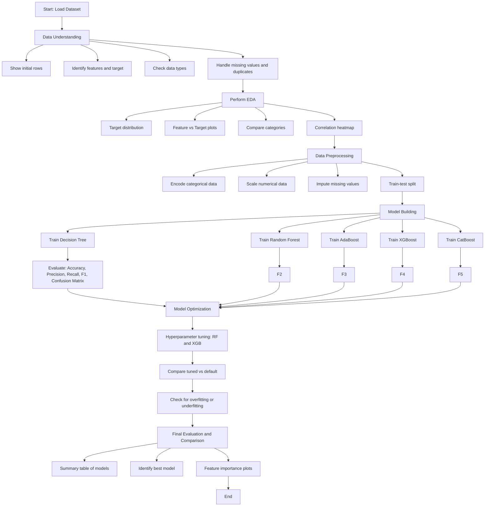

### 📊 Assignment: Classification with Machine Learning Models

```mermaid
flowchart TD
    A[Start: Load Dataset] --> B[Data Understanding]
    B --> B1[Show initial rows]
    B --> B2[Identify features and target]
    B --> B3[Check data types]
    B --> B4[Handle missing values and duplicates]

    B4 --> C[Perform EDA]
    C --> C1[Target distribution]
    C --> C2[Feature vs Target plots]
    C --> C3[Compare categories]
    C --> C4[Correlation heatmap]

    C4 --> D[Data Preprocessing]
    D --> D1[Encode categorical data]
    D --> D2[Scale numerical data]
    D --> D3[Impute missing values]
    D --> D4[Train-test split]

    D4 --> E[Model Building]
    E --> E1[Train Decision Tree]
    E --> E2[Train Random Forest]
    E --> E3[Train AdaBoost]
    E --> E4[Train XGBoost]
    E --> E5[Train CatBoost]

    E1 --> F1[Evaluate: Accuracy, Precision, Recall, F1, Confusion Matrix]
    E2 --> F2
    E3 --> F3
    E4 --> F4
    E5 --> F5

    F1 --> G[Model Optimization]
    F2 --> G
    F3 --> G
    F4 --> G
    F5 --> G

    G --> G1[Hyperparameter tuning: RF and XGB]
    G1 --> G2[Compare tuned vs default]
    G2 --> G3[Check for overfitting or underfitting]

    G3 --> H[Final Evaluation and Comparison]
    H --> H1[Summary table of models]
    H --> H2[Identify best model]
    H --> H3[Feature importance plots]

    H3 --> I[End]
```
